# EmoneyID

## 📱 Deskripsi Aplikasi
*eMoneyID** adalah aplikasi dompet digital inovatif yang dirancang khusus untuk Payment. Aplikasi ini memungkinkan anda  untuk melakukan berbagai transaksi sehari-hari seperti pengisian saldo (top-up), transfer antar pengguna,  penyewaan fasilitas/pembelian sepeda (seperti RentBike). 

Aplikasi ini dilengkapi dengan fitur keamanan canggih berupa Autentikasi Dua Langkah (2FA) menggunakan *Google Authenticator* (TOTP), serta mendukung integrasi *Deep Link* untuk memproses pembayaran langsung dari aplikasi pihak ketiga secara mulus.

---

## 🏗️ Arsitektur Aplikasi
Proyek ini dibangun menggunakan pendekatan **Clean Architecture** untuk memastikan kode yang modular, mudah di-maintenance, dan *scalable*. Struktur aplikasi dibagi menjadi tiga lapisan (*layers*) utama:

1. **Domain Layer (`lib/domain/`)**
   Lapisan paling dalam yang berisi aturan bisnis inti. Tidak bergantung pada paket eksternal (murni Dart).
   - **Entities**: Objek data murni (misal: `UserEntity`, `AccountEntity`).
   - **Repositories (Abstract)**: Antarmuka (*interface*) untuk kontrak akses data.
   - **Usecases**: Logika bisnis spesifik (misal: `TopupUsecase`, `DeepLinkPaymentUsecase`).

2. **Data Layer (`lib/data/`)**
   Bertanggung jawab penuh atas manajemen sumber data (Remote/API maupun Local/Storage).
   - **Datasources**: Akses ke API (menggunakan *Dio*) dan penyimpanan lokal (menggunakan *FlutterSecureStorage* dan *SharedPreferences*).
   - **Repositories (Impl)**: Implementasi dari *repository* yang didefinisikan di lapisan Domain.

3. **Presentation Layer (`lib/presentation/`)**
   Mengatur antarmuka pengguna (UI) dan manajemen *state*.
   - **BLoC**: *State management* yang mengatur logika tampilan (misal: `AuthBloc`, `PaymentBloc`).
   - **Pages**: Halaman antarmuka yang dibangun dengan berbagai widget UI.
   - **Widgets**: Komponen UI yang dapat digunakan kembali (*reusable*).

**Lainnya:**
- **Core (`lib/core/`)**: Konstanta, konfigurasi *Router* (`go_router`), *Theme*, dan penanganan *Deep Link* (`app_links`).
- **Injection (`lib/injection/`)**: *Dependency Injection* menggunakan `get_it`.

### 🗂️ Struktur Folder & File
```text
emoneyid/
├── android/
│   └── app/src/main/
│       ├── AndroidManifest.xml                ← Intent filter deep link
│       ├── res/                               ← Sumber daya Android (icon, splash, dll)
│       └── kotlin/com/example/emoneyid/
│           └── MainActivity.kt                ← Activity utama Android
├── ios/                                       ← Konfigurasi & resource iOS
├── web/                                       ← Konfigurasi & resource Web
├── linux/                                     ← Konfigurasi & resource Linux
├── macos/                                     ← Konfigurasi & resource macOS
├── windows/                                   ← Konfigurasi & resource Windows
├── test/                                      ← Unit & Widget tests
├── .gitignore
├── .metadata
├── analysis_options.yaml                      ← Aturan linting Dart
├── pubspec.yaml                               ← Dependencies utama
├── pubspec.lock                               ← Version lock dependencies
├── README.md
└── lib/
    ├── main.dart                              ← Entry point + deep link init
    ├── firebase_options.dart                  ← Konfigurasi Firebase otomatis
    ├── core/
    │   ├── constants/
    │   │   ├── api_endpoints.dart             ← Endpoints API (base URL, paths)
    │   │   └── app_constants.dart             ← Konstanta aplikasi (timeout, dll)
    │   ├── error/
    │   │   ├── exceptions.dart                ← Custom exception classes
    │   │   └── failures.dart                  ← Failure classes (untuk BLoC handling)
    │   ├── network/
    │   │   └── api_client.dart                ← Konfigurasi HTTP Client (Dio)
    │   ├── router/
    │   │   └── app_router.dart                ← Konfigurasi rute (go_router)
    │   ├── services/
    │   │   └── updated_deep_link_handler.dart ← Listener Deep Link (app_links)
    │   ├── theme/
    │   │   ├── app_colors.dart                ← Palet warna tema
    │   │   ├── app_text_styles.dart           ← Gaya teks kustom
    │   │   └── app_theme.dart                 ← Konfigurasi ThemeData
    │   └── utils/
    │       ├── app_bloc_observer.dart         ← Observer untuk debugging BLoC
    │       ├── currency_formatter.dart        ← Formatter Rupiah (Rp)
    │       └── date_formatter.dart            ← Formatter tanggal/waktu
    ├── data/
    │   ├── models/
    │   │   ├── account_model.dart             ← Model data akun
    │   │   ├── transaction_model.dart         ← Model data transaksi
    │   │   └── user_model.dart                ← Model data pengguna
    │   ├── datasources/
    │   │   ├── local/
    │   │   │   ├── secure_storage_datasource.dart  ← Penyimpanan token JWT
    │   │   │   └── balance_preferences_datasource.dart ← Sinkronisasi saldo lokal
    │   │   └── remote/
    │   │       ├── auth_remote_datasource.dart      ← API Autentikasi
    │   │       ├── account_remote_datasource.dart   ← API Akun
    │   │       ├── otp_remote_datasource.dart       ← API OTP
    │   │       ├── payment_remote_datasource.dart   ← API Pembayaran
    │   │       ├── mock_auth_remote_datasource.dart     ← Mock data auth (dev)
    │   │       ├── mock_account_remote_datasource.dart  ← Mock data akun (dev)
    │   │       ├── mock_otp_remote_datasource.dart      ← Mock data OTP (dev)
    │   │       └── mock_payment_remote_datasource.dart  ← Mock data pembayaran (dev)
    │   └── repositories/
    │       ├── account_repository_impl.dart   ← Implementasi repository akun
    │       ├── auth_repository_impl.dart      ← Implementasi repository auth
    │       ├── otp_repository_impl.dart       ← Implementasi repository OTP
    │       └── payment_repository_impl.dart   ← Implementasi repository pembayaran
    ├── domain/
    │   ├── entities/
    │   │   ├── account_entity.dart            ← Entitas akun
    │   │   ├── deeplink_payment_entity.dart   ← Entitas pembayaran Deep Link
    │   │   ├── otp_entity.dart                ← Entitas OTP
    │   │   ├── payment_result_entity.dart     ← Entitas hasil pembayaran
    │   │   ├── transaction_entity.dart        ← Entitas transaksi
    │   │   └── user_entity.dart               ← Entitas pengguna
    │   ├── repositories/
    │   │   ├── account_repository.dart        ← Interface repository akun
    │   │   ├── auth_repository.dart           ← Interface repository auth
    │   │   ├── otp_repository.dart            ← Interface repository OTP
    │   │   └── payment_repository.dart        ← Interface repository pembayaran
    │   └── usecases/
    │       ├── account/
    │       │   └── get_account_usecase.dart   ← Ambil data akun
    │       ├── auth/
    │       │   ├── get_me_usecase.dart        ← Ambil data profil login
    │       │   ├── logout_usecase.dart        ← Logout pengguna
    │       │   ├── register_with_otp_usecase.dart ← Registrasi + OTP
    │       │   ├── send_otp_usecase.dart      ← Kirim OTP
    │       │   ├── verify_email_otp_usecase.dart   ← Verifikasi OTP email
    │       │   └── verify_firebase_token_usecase.dart ← Verifikasi token Firebase
    │       └── payment/
    │           └── payment_usecases.dart      ← Usecase pembayaran (topup, transfer, dll)
    ├── data/repositories/                     ← Implementasi Interface Domain
    ├── injection/
    │   └── injection_container.dart           ← Setup Dependency Injection (get_it)
    └── presentation/
        ├── blocs/
        │   ├── account/
        │   │   └── account_bloc.dart          ← BLoC state akun & saldo
        │   ├── auth/
        │   │   ├── auth_bloc.dart             ← BLoC autentikasi utama
        │   │   └── otp_bloc.dart              ← BLoC alur OTP/registrasi
        │   └── payment/
        │       └── payment_bloc.dart          ← BLoC alur pembayaran
        ├── pages/
        │   ├── account/
        │   │   └── account_page.dart          ← Halaman profil & akun
        │   ├── auth/
        │   │   ├── login_page.dart            ← Halaman masuk
        │   │   ├── register_page.dart         ← Halaman pendaftaran
        │   │   ├── verify_email_page.dart     ← Halaman verifikasi email
        │   │   ├── setup_2fa_page.dart        ← Halaman pengaturan 2FA
        │   │   ├── twofa_totp_page.dart       ← Halaman autentikasi TOTP
        │   │   ├── twofa_notif_page.dart      ← Halaman notifikasi 2FA
        │   │   └── twofa_smtp_page.dart       ← Halaman SMTP 2FA
        │   ├── history/
        │   │   └── history_page.dart          ← Halaman riwayat transaksi
        │   ├── home/
        │   │   └── home_page.dart             ← Halaman beranda utama
        │   ├── merchant/
        │   │   └── merchant_checkout_page.dart ← Halaman checkout merchant
        │   ├── payment/
        │   │   ├── payment_qr_page.dart       ← Halaman bayar via QR
        │   │   ├── deeplink_payment_page.dart ← Halaman bayar via Deep Link
        │   │   └── pin_page.dart              ← Halaman input PIN pembayaran
        │   ├── promo/
        │   │   └── promo_page.dart            ← Halaman promosi/banner
        │   ├── splash/
        │   │   └── splash_page.dart           ← Halaman splash screen
        │   ├── success/
        │   │   └── success_page.dart          ← Halaman sukses transaksi
        │   ├── topup/
        │   │   └── topup_page.dart            ← Halaman isi saldo
        │   └── transfer/
        │       ├── transfer_page.dart         ← Halaman transfer utama
        │       ├── transfer_amount_page.dart  ← Halaman input nominal transfer
        │       └── transfer_confirm_page.dart ← Halaman konfirmasi transfer
        └── widgets/
            ├── app_avatar.dart                ← Widget avatar pengguna
            ├── app_badge.dart                 ← Widget badge notifikasi
            ├── app_button.dart                ← Widget tombol kustom
            ├── app_field.dart                 ← Widget input field
            ├── app_logo.dart                  ← Widget logo aplikasi
            ├── app_tab_bar.dart               ← Widget tab bar
            ├── app_top_bar.dart               ← Widget top bar / header
            ├── brutalism_3d_icon.dart         ← Widget ikon 3D gaya brutalism
            ├── brutalism_nav_bar.dart         ← Widget bottom navigation bar
            ├── code_input.dart                ← Widget input kode OTP
            ├── feature_icon.dart              ← Widget ikon fitur
            ├── num_pad.dart                   ← Widget numpad (PIN)
            ├── pin_pad.dart                   ← Widget keypad PIN
            ├── profile_greeting_widget.dart   ← Widget sapaan profil
            ├── success_check.dart             ← Widget animasi centang sukses
            └── transaction_row.dart           ← Widget baris riwayat transaksi
```

---

## 🚀 Cara Menjalankan Proyek

### Persyaratan
- Flutter SDK (Versi terbaru disarankan)
- Dart SDK
- Android Studio / VS Code
- Emulator atau Perangkat Android (Disarankan Android 11+ untuk pengujian *Deep Link*)

### Langkah-langkah
1. **Clone repositori ini:**
   ```bash
   git clone <url-repo-anda>
   cd emoneyid
   ```

2. **Unduh dependensi:**
   ```bash
   flutter pub get
   ```

3. **(Opsional) Atur URL API Lokal:**
   Secara *default*, aplikasi mengarah ke `http://192.168.0.105:8080`. Jika Anda memiliki server backend sendiri, Anda bisa melakukan *override* menggunakan argumen `--dart-define` saat menjalankan aplikasi:
   ```bash
   flutter run --dart-define=API_BASE_URL=http://<IP_ANDA>:8080
   ```

4. **Jalankan Aplikasi:**
   ```bash
   flutter run
   ```

> **Catatan Pengujian Deep Link:**
> Untuk menguji fitur pembayaran via *Deep Link* dari aplikasi eksternal seperti RentBike, pastikan kedua aplikasi (eMoneyID dan RentBike) sudah di-*build* dan terpasang di perangkat/emulator yang sama.

---

## 📦 Daftar Dependensi Utama

Berikut adalah pustaka (*packages*) utama penyokong fitur aplikasi ini (dapat dilihat lebih detail di `pubspec.yaml`):

- **State Management & Routing:**
  - `flutter_bloc` (^9.0.0): Mengelola aliran *state* secara terpusat dan reaktif.
  - `go_router` (^14.8.1): Menangani navigasi, alur rute bersarang (*shell routes*), dan *passing data*.
- **Dependency Injection & Model:**
  - `get_it` (^8.0.2): *Service locator* untuk menghubungkan antar lapisan arsitektur.
  - `equatable` (^2.0.5): Memudahkan perbandingan *value equality* antar objek untuk optimalisasi *render* BLoC.
- **Networking & Deep Link:**
  - `dio` (^5.7.0): Klien HTTP andal untuk *request* API.
  - `app_links` (^6.4.0): Mendengarkan dan memproses URI *Deep Link* yang ditangkap oleh OS Android.
  - `url_launcher` (^6.3.1): Mengeksekusi *callback Intent* ke aplikasi pihak ketiga (seperti `rentbike://success`).
- **Keamanan & Penyimpanan Lokal:**
  - `flutter_secure_storage` (^9.2.2): Penyimpanan aman terenkripsi (Keystore) untuk menampung token JWT.
  - `shared_preferences` (^2.3.4): Menampung sinkronisasi riwayat saldo statis (*BalanceLocal*).
- **Integrasi Firebase:**
  - `firebase_auth`, `firebase_core`, `google_sign_in`: Mengurus *login*, pendaftaran, serta distribusi OTP lewat email.

---

## 📸 Hasil Screenshot Tampilan Aplikasi

### 📲 eMoneyID (Aplikasi Utama)

<table>
  <tr>
    <td align="center"><b>1. Tampilan Awal (Splash Screen)</b></td>
    <td align="center"><b>2. Halaman Login</b></td>
    <td align="center"><b>3. Halaman Daftar Akun</b></td>
  </tr>
  <tr>
    <td align="center">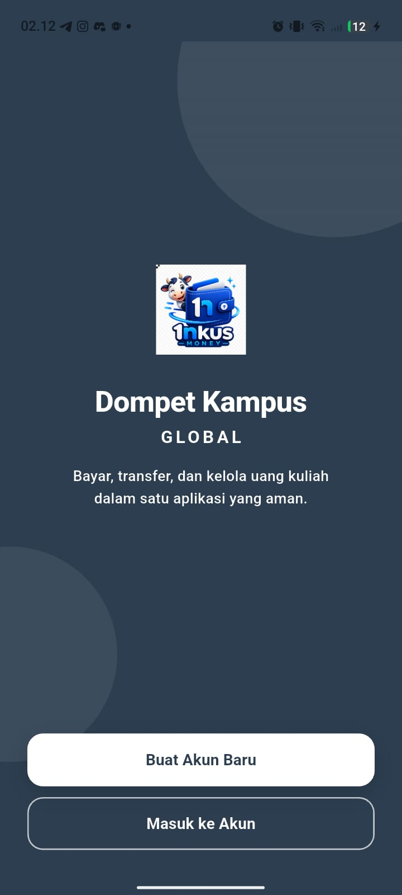</td>
    <td align="center">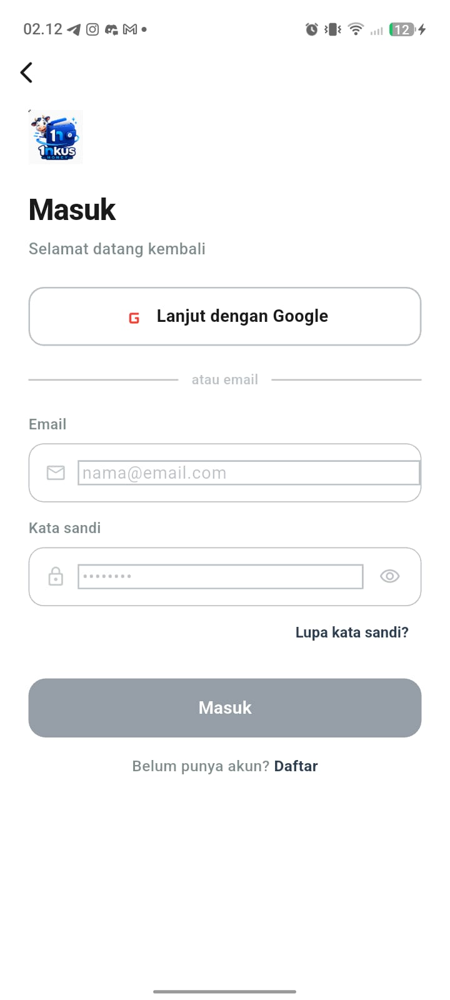</td>
    <td align="center">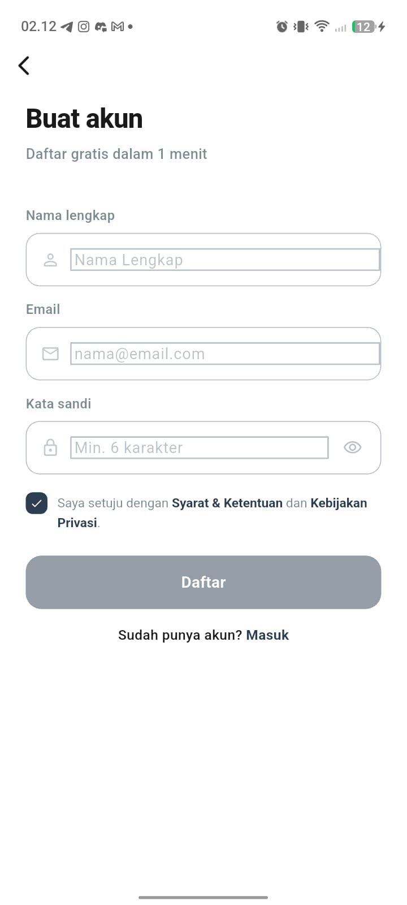</td>
  </tr>
  <tr>
    <td align="center"><b>4. Verifikasi OTP</b></td>
    <td align="center"><b>5. Halaman Beranda (Home)</b></td>
    <td align="center"><b>6. Halaman Top Up Saldo</b></td>
  </tr>
  <tr>
    <td align="center">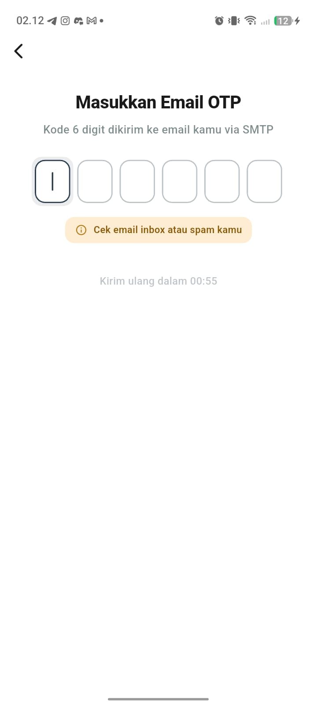</td>
    <td align="center">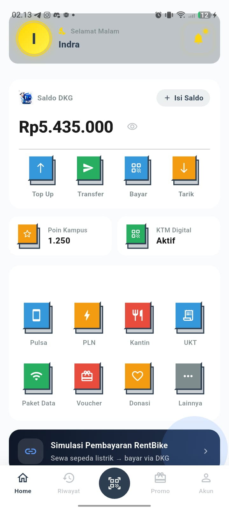</td>
    <td align="center">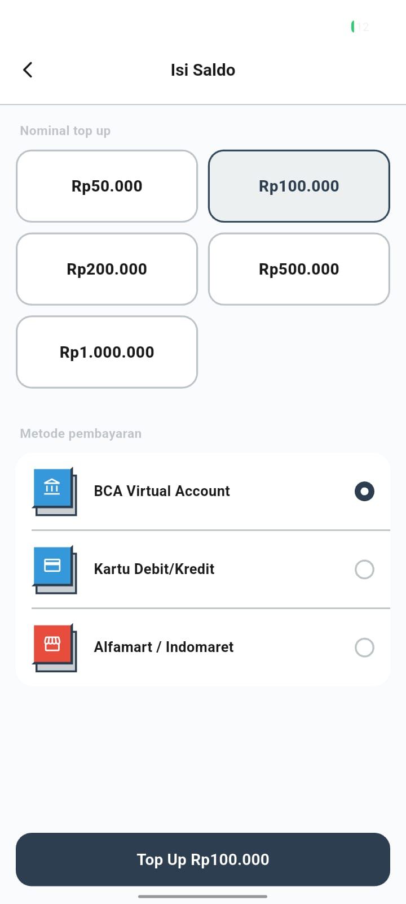</td>
  </tr>
  <tr>
    <td align="center"><b>7. Halaman Profil & Akun</b></td>
    <td align="center"><b>8. Halaman Autentikator</b></td>
    <td align="center"><b>9. Pengaturan 2FA</b></td>
  </tr>
  <tr>
    <td align="center">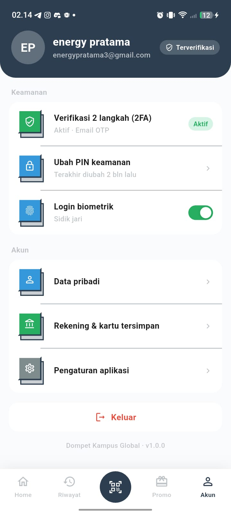</td>
    <td align="center">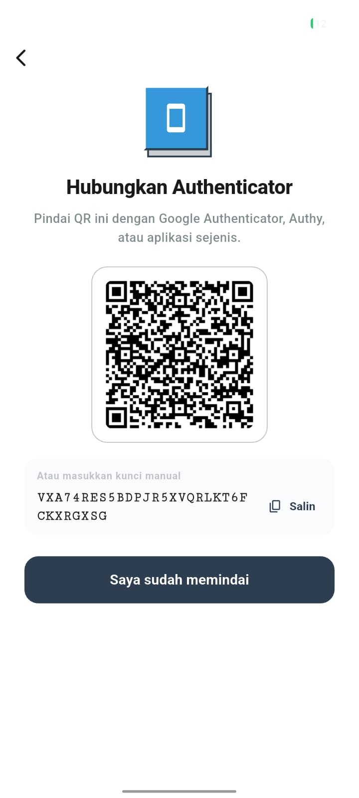</td>
    <td align="center">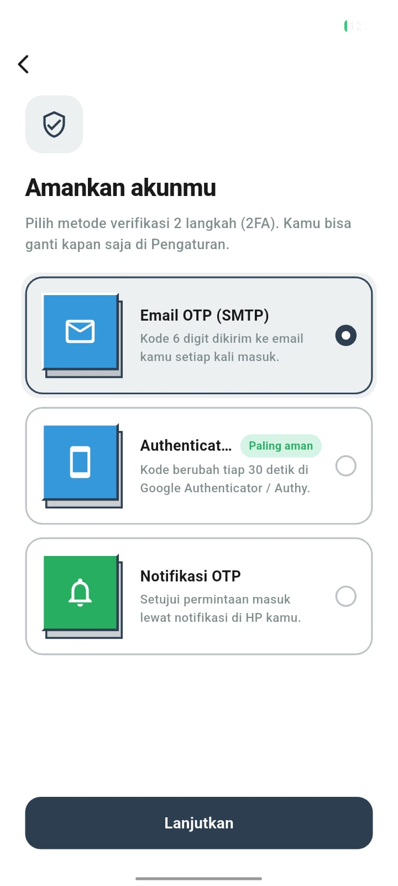</td>
  </tr>
  <tr>
    <td align="center"><b>10. Konfirmasi Pembayaran</b></td>
    <td></td>
    <td></td>
  </tr>
  <tr>
    <td align="center">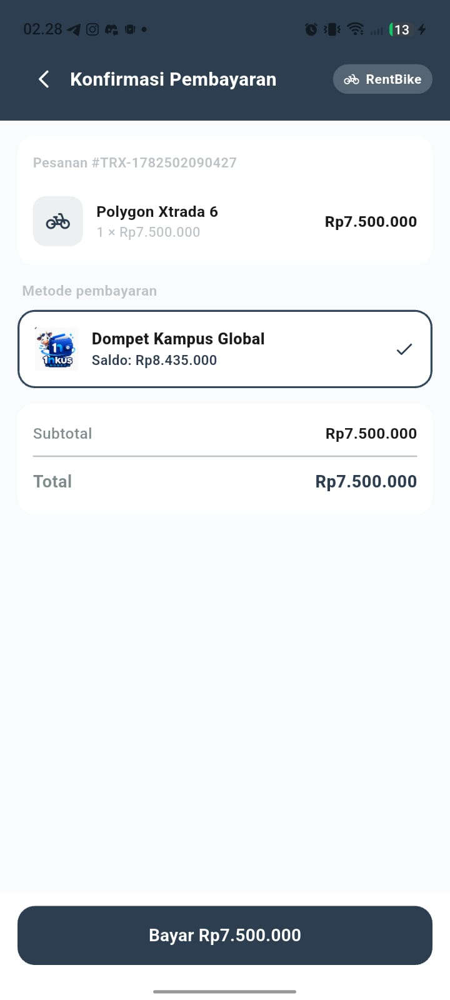</td>
    <td></td>
    <td></td>
  </tr>
</table>

### 📊 Riwayat Transaksi

<table>
  <tr>
    <td align="center"><b>1. Riwayat Semua Transaksi</b></td>
    <td align="center"><b>2. Riwayat Pengeluaran</b></td>
    <td align="center"><b>3. Riwayat Pemasukan</b></td>
  </tr>
  <tr>
    <td align="center">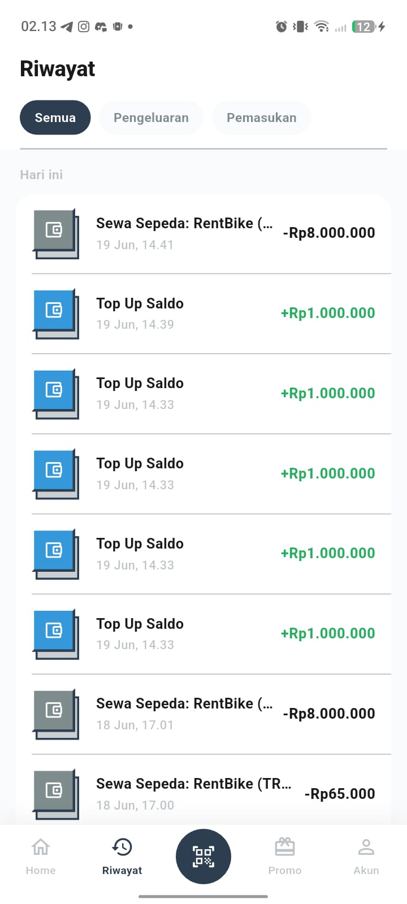</td>
    <td align="center">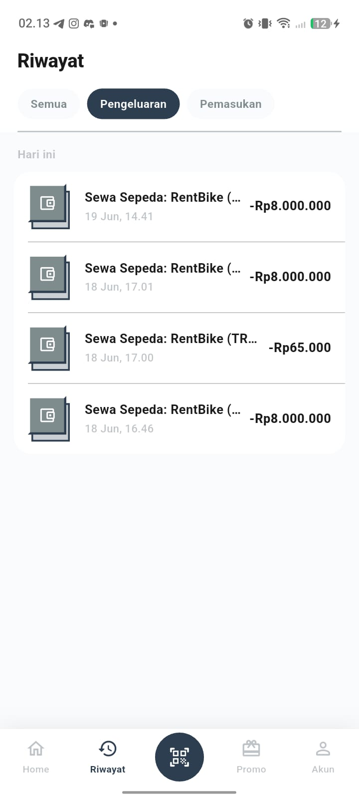</td>
    <td align="center">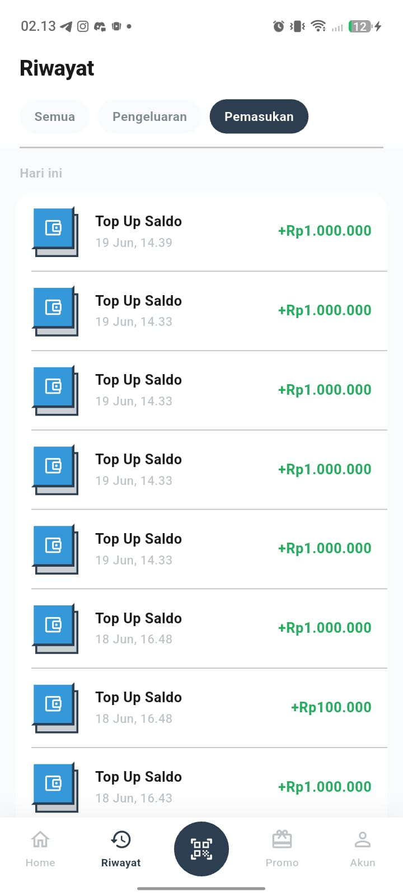</td>
  </tr>
</table>

### 🚲 eComerce RentBike (Aplikasi Mitra)

<table>
  <tr>
    <td align="center"><b>1. Halaman Login</b></td>
    <td align="center"><b>2. Halaman Daftar Akun</b></td>
    <td align="center"><b>3. Halaman Beranda (Home)</b></td>
  </tr>
  <tr>
    <td align="center">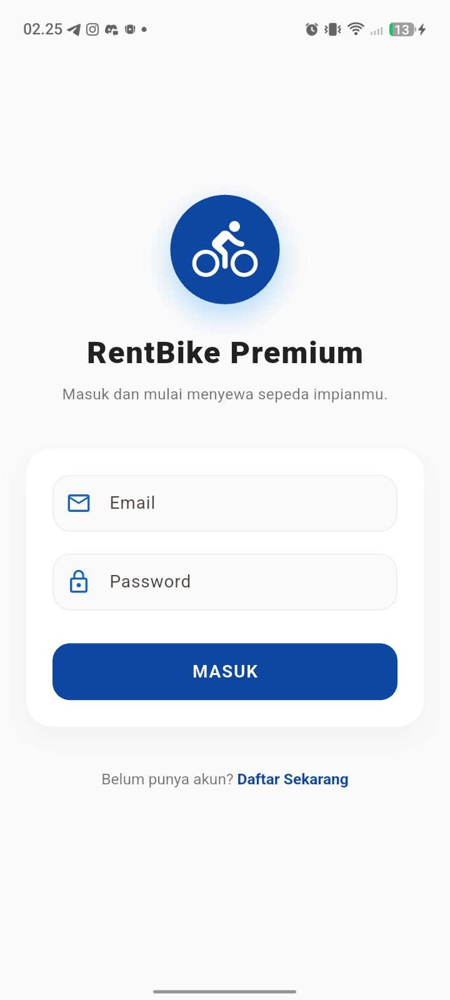</td>
    <td align="center">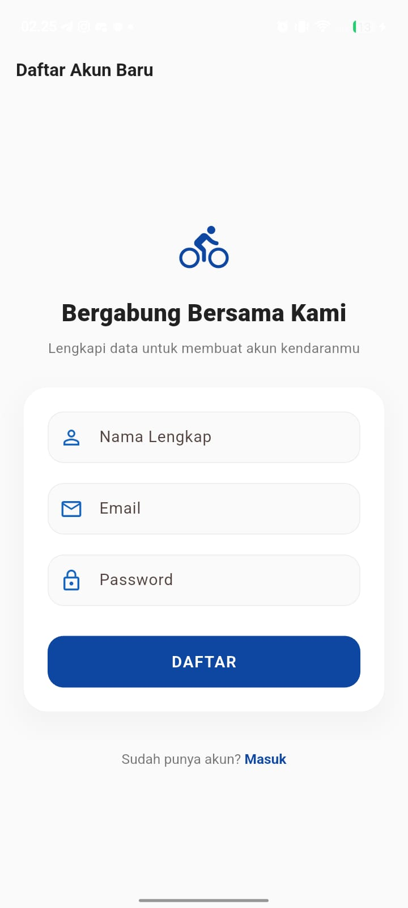</td>
    <td align="center">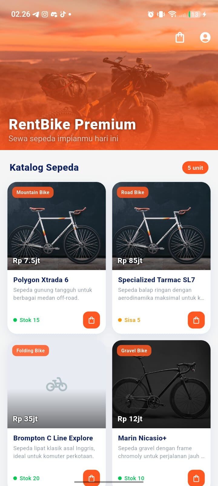</td>
  </tr>
  <tr>
    <td align="center"><b>4. Halaman Profil & Akun</b></td>
    <td align="center"><b>5. Halaman Checkout</b></td>
    <td align="center"><b>6. Pilihan Metode Pembayaran</b></td>
  </tr>
  <tr>
    <td align="center">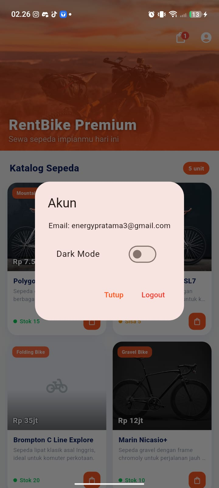</td>
    <td align="center">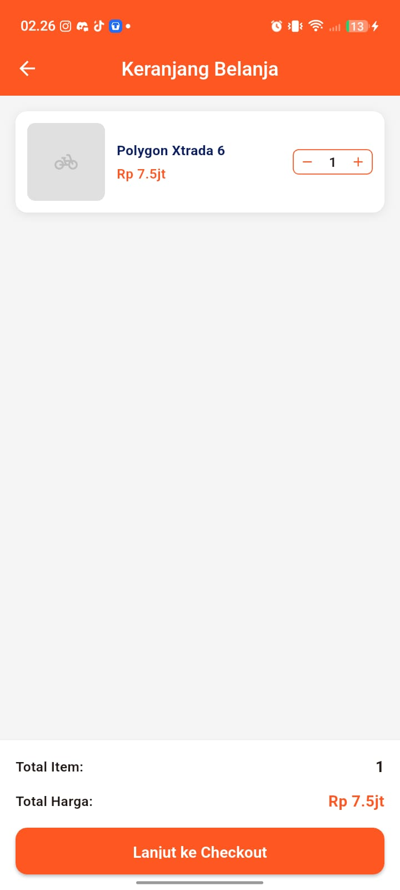</td>
    <td align="center">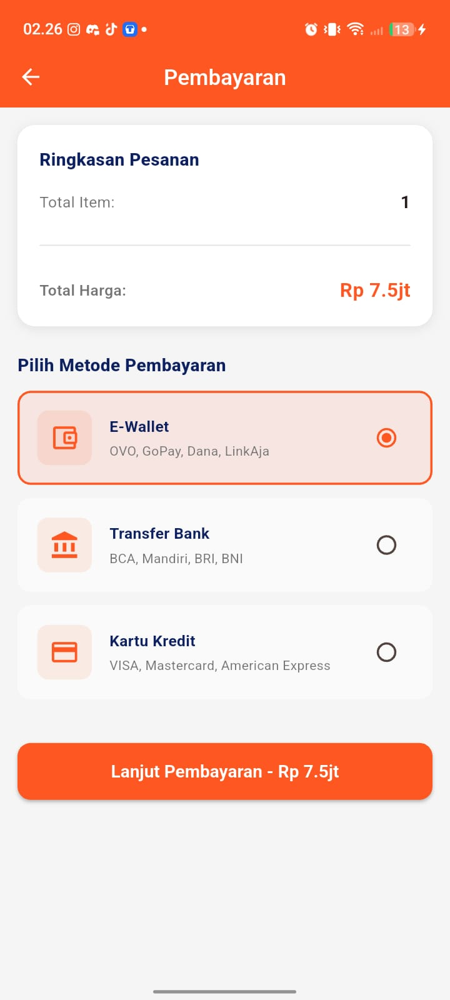</td>
  </tr>
  <tr>
    <td align="center"><b>7. Konfirmasi Pembayaran</b></td>
    <td align="center"><b>8. Halaman Bayar</b></td>
    <td></td>
  </tr>
  <tr>
    <td align="center">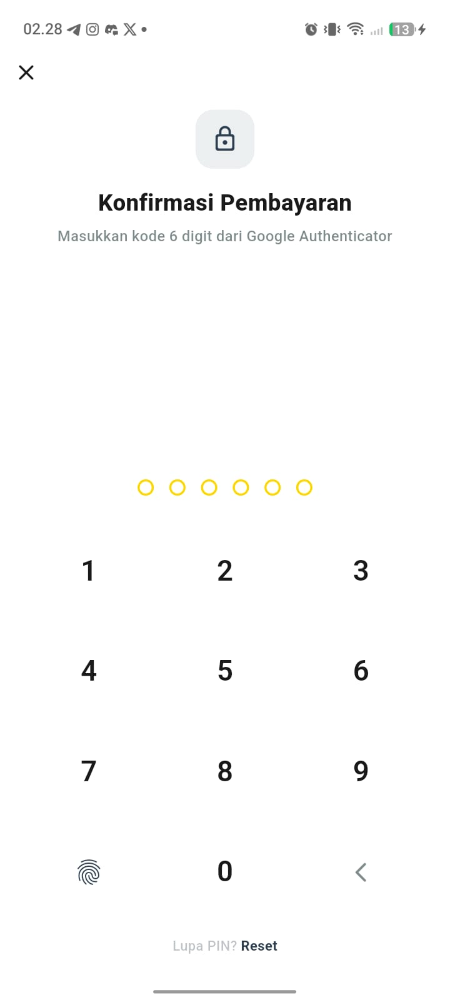</td>
    <td align="center"></td>
    <td></td>
  </tr>
</table>

---

## 🎬 Demo Video

<p align="center">
  <a href="https://youtu.be/MoBqWi3-7Y4?si=ij-4Q-_1g_ZxDyrf">
    
  </a>
</p>

<p align="center">
  <a href="https://youtu.be/MoBqWi3-7Y4?si=ij-4Q-_1g_ZxDyrf"><b>▶ Tonton Demo di YouTube</b></a>
</p>
